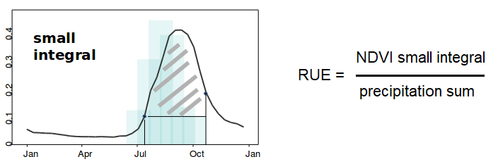
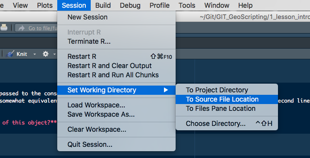
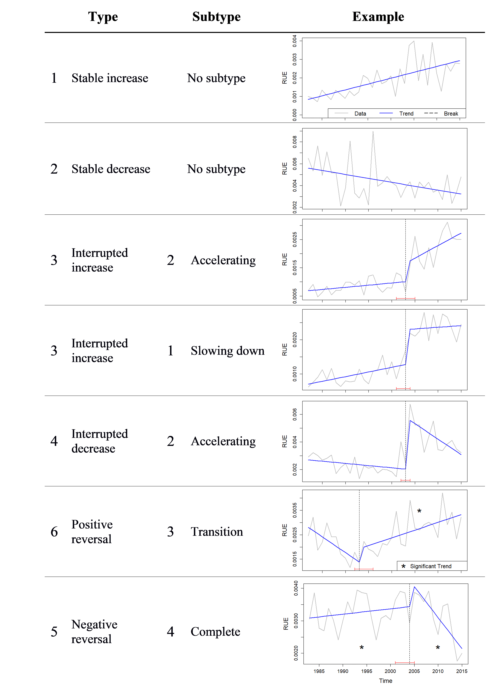

# Detecting and characterizing turning points using BFAST01

Paulo N Bernardino (paulo.nbernardino@gmail.com)

[Division Forest, Nature and Landscape, KU Leuven](https://ees.kuleuven.be/fnl/staff/index.html?intranet=u0115271)

[Laboratory of Geo-information Science and Remote Sensing, Wageningen UR](https://www.wur.nl/en/Persons/Paulo-P-Paulo-Negri-Bernardino-MSc.htm)

```{r, eval=TRUE, echo=TRUE, include=TRUE, results='asis'}
format(Sys.time(), '%d-%m-%Y')
```
# Abrupt changes in dryland ecosystem functioning

Drylands ecosystems are important - covering 40% of the Earth's surface, accounting for approximately 40% of the global net primary productivity and supporting more than 30% of the population - but are largely under pressure. They are subjected to ongoing global change, devastating climate extremes and unsustainable use of natural resources. These have led in the past to major alterations in functioning and land degradation, threatening the ability of the ecosystems to provide resources and services to the communities and resulting in increased poverty and food insecurity. 

Changes in the functioning of an ecosystem can take place abruptly, rather than gradually. For instance, when rainfall levels of a region decrease slowly for some years, it is likely that a decreasing trend in ecosystem functioning will also be observed; while when an extreme drought strikes a region, it is likely that an abrupt drop in ecosystem functioning will occur. 
The goals of this exercise are: (i) assess and characterize gradual/abrupt changes in ecosystem functioning over six dryland areas and (ii) gain insights in the potential drivers of these changes (i.e., are the changes likely driven by anthropogenic or climatic pressure?).

## How can we estimate ecosystem functioning in drylands?

Environmental sciences researchers that work with Earth Observation data are used to work with traditional vegetation indices, like the NDVI, and with precipitation data. But is NDVI a good proxy for ecosystem functioning? Do abrupt changes in NDVI time series reflect changes in the functioning of the ecosystem? 

We will here use the Rain-Use Efficiency (RUE), a key indicator for measuring the response of plant production to precipitation, calculated as the ratio between Net Primary Productivity (NPP) and precipitation. The detection of major breakpoints in RUE time series indicates that the ecosystem response to precipitation has changed significantly through time and, ultimately, that the ecosystem underwent a turning point in ecosystem functioning.

To estimate NPP we will use the growing season NDVI small integral, which will be divided by the sum of precipitation during the growing season months to derive the annual RUE time series. 



The NDVI data used was the GIMMS NDVI3g.v1, downloaded from the [ECOCAST archive](https://climatedataguide.ucar.edu/climate-data/ndvi-normalized-difference-vegetation-index-3rd-generation-nasagfsc-gimms). Precipitation data came from the Climate Hazards Group InfraRed Precipitation with Station data (CHIRPS), which can be found [here](https://www.chc.ucsb.edu/data/chirps).

As computing the growing season NDVI small integral and precipitation sum would take too long, we already provide [here](https://drive.google.com/open?id=1QmzgtuKSVGJGoRaKwu0aL-p4JR2sCWxr) the time series of (1) monthly NDVI, (2) annual growing season NDVI integral and (3) annual precipitation sum during the growing season, for six dryland areas (the coordinates of those areas are also provided in "Area_coordinates.csv").

First of all, we have to set our working directory, install the necessary packages and load some functions. How to do it is explained in the next section.


# Getting started

First, choose your working directory (i.e., a folder on your hard drive) to which the  data will be downloaded and where you will save your R script.

```{block type="alert alert-info"}
**Protip**: Do not hard code `setwd()` in your R script as the path might be different on another computer, and therefore your script will not be fully reproducible by others.
```

In RStudio you can set your working directory this way, if you have saved your R script to your working directory:



Check your working directory by

```{r, eval = FALSE}
getwd() # check if your working directory is correctly set
```

The necessary add-on packages need to be installed within R before loading the package using the `library()` function. Below, we define a helper function that installs the R package if it is not installed yet, and then also loads it using the `library` function:

```{r, echo=TRUE, message=FALSE, eval=TRUE}
# pkgTest is a helper function to load packages and install packages only when they are not installed yet.
pkgTest <- function(x)
{
  if (x %in% rownames(installed.packages()) == FALSE) {
    install.packages(x, dependencies= TRUE)
  }
  library(x, character.only = TRUE)
}
neededPackages <- c("strucchange","zoo", "bfast", "raster", "rgdal")
for (package in neededPackages){pkgTest(package)}
```


## Downloading the data

The link to the dataset used in this exercise is [here](https://raw.github.com/paulonbernardino/Exercises/master/BFAST01_new_typo_exercise/data/data.zip)

You can use the link to download the dataset, and unzip it, without leaving the R environment. But first, we need to create a folder to store the data.

```{r, message = FALSE}
## Create "data" folder, if it doesn't exist already
ifelse(!dir.exists(file.path("data")), dir.create(file.path("data")), FALSE)

## Download files and save them in the data folder
download.file(url="https://raw.github.com/paulonbernardino/Exercises/master/BFAST01_new_typo_exercise/data/data.zip", destfile="data/dataset.zip", method="auto")
unzip("data/dataset.zip", exdir="data")
```

Next, we also need the functions inside the "functions.R" script. So let's download it from the Github repository and load the functions to the Environment, so they can be used in our RStudio session:

```{r, message = FALSE}
download.file(url="https://raw.github.com/paulonbernardino/Exercises/master/BFAST01_new_typo_exercise/functions.R", destfile="functions.R", method="auto")
source("functions.R")
```

Now that all the data is downloaded, we can load it into R.

```{r, message = FALSE}
## List files inside the data folder
files <- list.files("data", pattern="*.csv", full.names = TRUE)
## Read files as data frames
coordinates <- read.csv(files[1], header=T, sep=";")
rainfall <- read.csv(files[2], header=T, sep=";")
ndvi <- read.csv(files[3], header=T, sep=";")
ndvi_sint <- read.csv(files[4], header=T, sep=";")
```

## Visualizing time series

Let's see how the time series of vegetation greenness looks like for study area #6. Our data ranges from Jan-1982 to Dec-2015, and as we have monthly NDVI data, we should have in total 408 columns (1 for each month) and 6 rows (1 for each study area) in the data frame.

```{r, echo=TRUE, message = FALSE}
ncol(ndvi)
nrow(ndvi)
```

So we can create a time series starting at 01-1982, ending at 12-2015, and with a monthly (12) frequency:

```{r, echo=TRUE, message = FALSE, fig.width=12}
## Create time series object
ts6_ndvi <- ts(as.numeric(ndvi[6,]), start=c(1982,01), end=c(2015,12), frequency=12)
## Plot time series
par(mar = c(5,5,2,5)) # adjust margins
plot(ts6_ndvi, main="Study area 6", bty="n", axes = FALSE, cex.main = 1.7, xlab = "", ylab = "")
axis(1, cex.axis = 1.5); mtext("Time", side = 1, line = 3, cex = 1.6)
axis(2, cex.axis = 1.5); mtext("NDVI", side = 2, line = 3, cex = 1.6)
```

The NDVI small integral and precipitation sum, in turn, are annual, so the time series will have fewer time steps.

```{r, echo=TRUE, message = FALSE}
## Create time series objects
ts6_ndvisint <- ts(as.numeric(ndvi_sint[6,]), start=1982, end=2015, frequency=1)
ts6_rain <- ts(as.numeric(rainfall[6,]), start=1982, end=2015, frequency=1)

## Plot time series
par(mar = c(5,5,2,5))
# First plot the NDVI small integral
plot(ts6_ndvisint, ylab="NDVI small integral", main="Study area 6", bty="n")
# Call a new plot, on top of the one already plotted
par(new = TRUE)
plot(ts6_rain, axes = FALSE, xlab = NA, ylab = NA, type = "l", lty = 5, col = "blue", ylim = c(280, 740))
axis(side = 4) # add the axis for the precipitation data
mtext(side = 4, line = 3, "Sum of precipitation (mm)") # add the label
legend("bottomright", cex = 0.8, legend = c("NDVI", "Precipitation"), col = c("black", "blue"), lty= c(1,5), bty="n") # add a legend
```

```{block, type="alert alert-success"}
> **Question 1**: Can you see any interesting patterns in the time series? What happens towards the end? Are both time series increasing at the same rate?
```

# Detecting turning points in ecosystem functioning

As discussed above, abrupt changes in RUE time series indicate points in time when the ecosystem response to precipitation changed significantly, and thus, turning points (TPs) in ecosystem functioning. To detect abrupt changes, we can use the BFAST function ( [Verbesselt et al., 2010](https://www.sciencedirect.com/science/article/abs/pii/S003442570900265X)). But first, we need to derive RUE using the data provided.

## Deriving RUE

This step is rather simple, as we already have both the NPP estimates (growing season NDVI small integral) and the sum of precipitation data. We just need to divide one by the other:

```{r, echo=TRUE, message = FALSE}
ts6_rue <- ts6_ndvisint/ts6_rain
plot(ts6_rue*1000, ylab="RUE (x 10³)", main="Study area 6", bty="n")
```

## Using BFAST01 to detect turning points

Now we can finally check if there was a TP in our first study area. Instead of the regular BFAST function, we will here use BFAST01, which focus only on the single major break in the time series, and also allows the characterization of the detected changes. 


```{r, echo=TRUE, message = FALSE}
bf1_sa6 <- bfast01(ts6_rue, formula = response~trend)
```

```{block type="alert alert-info"}
**Protip**: Look at `?bfast01` for more details. Here, we used a `response~trend` model, as our time series is annual and thus, doesn't have (intra-annual) seasonality. 
```

```{r, echo=TRUE, message=FALSE}
bf1_sa6$breaks # BFAST01 detected a break in the time series
time(ts6_rue)[bf1_sa6$breakpoints] # the break happened in 2001
plot(bf1_sa6, ylab="RUE", main="TP in Study area 6", bty="n")
```

We can see a clear TP in ecosystem functioning happening in 2000. How do the trends behave before and after the TP? Let's characterize the TP we just identified.

## Using BFAST01classify to characterize the detected changes

Besides detecting abrupt changes, BFAST01 can also classify them based on the fitted trends before and after the TP. You just need to provide a `bf1` object to the `bfast01classify` function and *voilà*!

```{r, echo=TRUE, message = FALSE}
bfast01classify(bf1_sa6, typology = "drylands")
```

The `flag_type` 3 indicates that we have an "Interrupted increase" in ecosystem functioning, and `flag_subtype` 2 means that the increase rate is higher after the TP, i.e., we have an "Accelerating interrupted increase". Below you can find a table with information about the different types and subtypes of ecosystem functioning change. For more information, have a look at [Bernardino et al. (2020)]().

{width=78%}

```{block type="alert alert-info"}
**Protip**: Note that we used `typology = "drylands"`. This typology provides a type and a subtype of changes. While the type provides information about the direction of change before and after the break, the subtype tells us about the rate of change before/after the break and the status of a reversal in trends direction. Thus, we have extra information when compared to the `"standard"` typology of `BFAST01`. 
```

# The other study areas

We successfully detected and characterized a TP in the sixth study area. What about the others? First of all, let's have a look at where our study areas are located, using the downloaded shapefile containing global administrative borders and the data frame with coordinates of our study areas.

```{r, echo=TRUE, message = FALSE}
coordinates # print coordinates 
```

```{r, message = FALSE}
world_brd <- readOGR("data/TM_WORLD_BORDERS_SIMPL-0.3.shp") # load shapefile with countries' administrative borders
ndvi_Dec2015 <- raster("data/GIMMS_NDVI_drylands_Dec2015.tif") # raster with NDVI values in December 2015, to be used as a background map
plot(ndvi_Dec2015)
plot(world_brd, add = TRUE)

## Convert coordinates into a spatialPointsDataFrame
coordinates <- coordinates[,c(2,1)] # invert order of Lon and Lat
study_areas <- SpatialPointsDataFrame(coordinates, data = data.frame(study_area = c(1:6)), proj4string = CRS(proj4string(ndvi_Dec2015)))

plot(study_areas, add = T, col = "red", cex = 1.1)
text(study_areas, labels = as.character(study_areas@data$study_area), col = "red", halo = TRUE, pos = 3, cex = 1.5)
```

Now let's retrieve the name of the country where our sixth study area is located.

```{r, message=FALSE}
country_area6 <- extract(world_brd, study_areas[study_areas@data$study_area==6,])
as.character(country_area6$NAME)
```

# Exercises

```{block, type="alert alert-success"}
> **Question 2**: Apply the method presented in the tutorial to detect and characterize TPs in ecosystem functioning in study areas 1 to 5. What are the types, subtypes, and time of TP occurrence for each?
```


```{block, type="alert alert-success"}
> **Question 3**:  Determine in which countries the study areas are located. Based on the characterization done in the previous question, in which of the study area countries do you see an increase in ecosystem functioning? And in which ones do you see degradation?  
```


```{block, type="alert alert-success"}
> **Question 4**:  Based on the comparison of vegetation productivity (NDVI small integral) and precipitation trends, as proposed by [Horion et al., (2016)](https://doi.org/10.1111/gcb.13267), try to determine if the ecosystem at each study area is under high or low anthropogenic influence.
```


<br><br>
<br><br>
<a rel="license" href="http://creativecommons.org/licenses/by-sa/4.0/"></a><br />This work is licensed under a <a rel="license" href="http://creativecommons.org/licenses/by-sa/4.0/">Creative Commons Attribution-ShareAlike 4.0 International License</a>.

